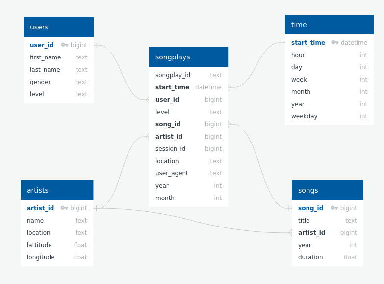

# Sparkify AWS Data Lake ETL

## Overview

The [`etl.py`](etl.py) script in this project reads from two sets of information (song data and event-based analytics for songplays from the Sparkify app) and derives a more analytics-friendly schema. It splits the two datasets into five tables.

**songplays:** songs played by individual users.

**users:** basic user information

**songs:** essential song information

**artists:** artist information

**time:** a standardized calendar table for convenient time-based analytics

## Dependencies

The only library required for this project is PySpark, the Apache Spark API for Python.

## Notes on Running the Script

Aside from including any necessary information in [`dl.cfg`](dl.cfg), you will also need to update [`etl.py`](etl.py) with the input and output S3 bucket URIs to match your own setup. The relevant portions of the script are on lines 173-177.

Pay special attention to lines 176 and 177 to make sure that the nested .json filepath that you are working with is correct, and any necessary wildcards have been inclulded.

Other than that, you should be able to invoke the script without any trouble, presuming that you are running it in an environment that has the proper access to your S3 objects and your Python environment has the libraries listed in the dependencies.
